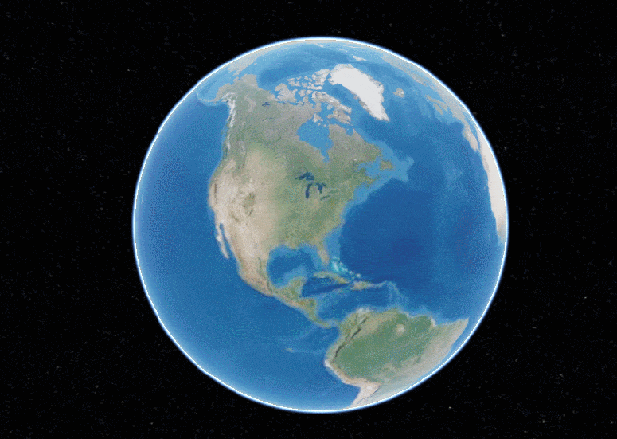
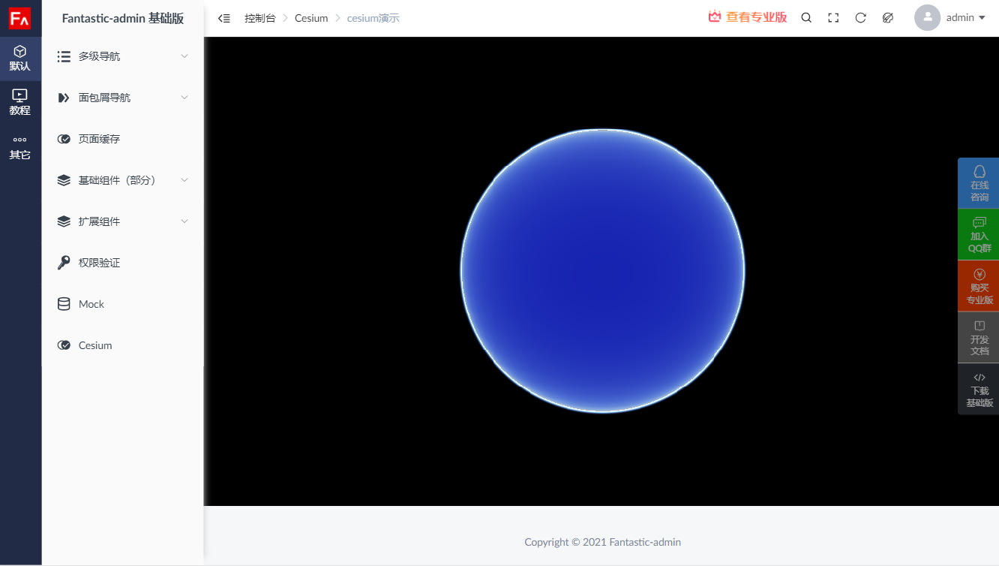
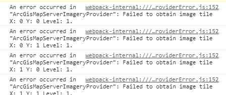
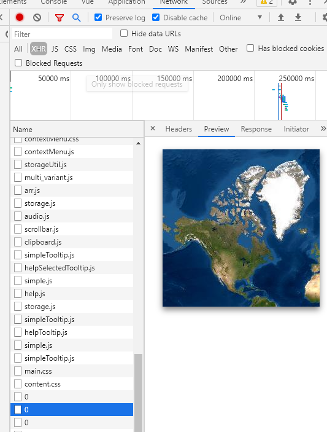

vue-cesium文件夹中的，是我用vue-cli创建的demo项目，用到了cesium这样一个显示三维地球和地图的库，安装完依赖写好配置之后运行，可以看到这样的效果：

但是将这个库移植到fantastic admin中，地球可以加载出来，但是贴图加载不出来：

控制台有报错警告：

显示图片加载错误，地图贴图是网络请求的，有时候网络不好，确实会无法请求到贴图，但是在fantastic admin中会一直这样，在我创建的demo中却是可以加载出来的。如果是网络问题，应该两个都加载有问题。
而且fantastic admin会100%报这样的错误。

在网络请求的控制台中可以看到图片是有正确返回：

好像是浏览器自己做了什么拦截似的。

我现在就很疑惑，是fantastic admin有什么特殊的设置才能运行这个库吗？
因为在我自己的Vue项目中，正常配置了之后是完全可以运行。
